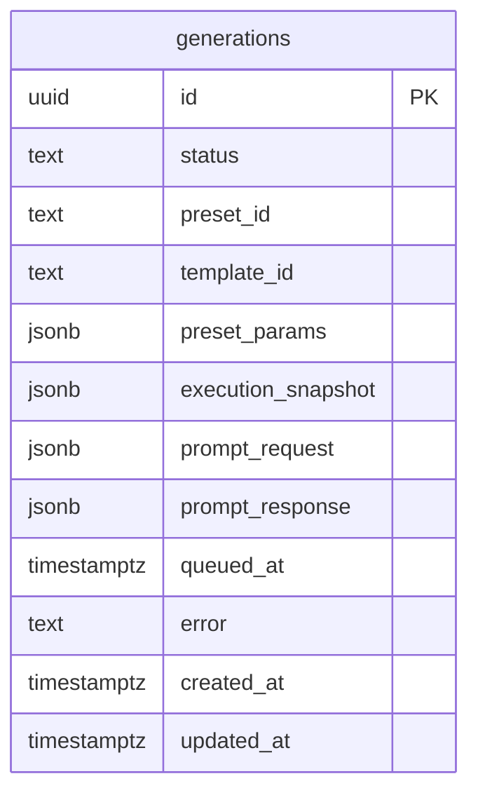

# Tables

| Name | Columns | Comment |
|------|---------|---------|
| [generations](#generations) | 12 |  |

---

## generations

### Columns

| Name | Type | Default | Nullable | Children | Parents | Comment |
|------|------|---------|----------|----------|---------|---------|
| **id** | uuid | - | NO | - | - | - |
| status | text | - | NO | - | - | - |
| preset_id | text | - | NO | - | - | - |
| template_id | text | - | NO | - | - | - |
| preset_params | jsonb | - | NO | - | - | - |
| execution_snapshot | jsonb | - | YES | - | - | - |
| prompt_request | jsonb | - | YES | - | - | - |
| prompt_response | jsonb | - | YES | - | - | - |
| queued_at | timestamp with time zone | - | YES | - | - | - |
| error | text | - | YES | - | - | - |
| created_at | timestamp with time zone | - | NO | - | - | - |
| updated_at | timestamp with time zone | - | NO | - | - | - |

---

## ER Diagram

