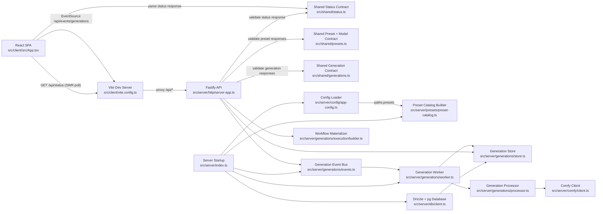
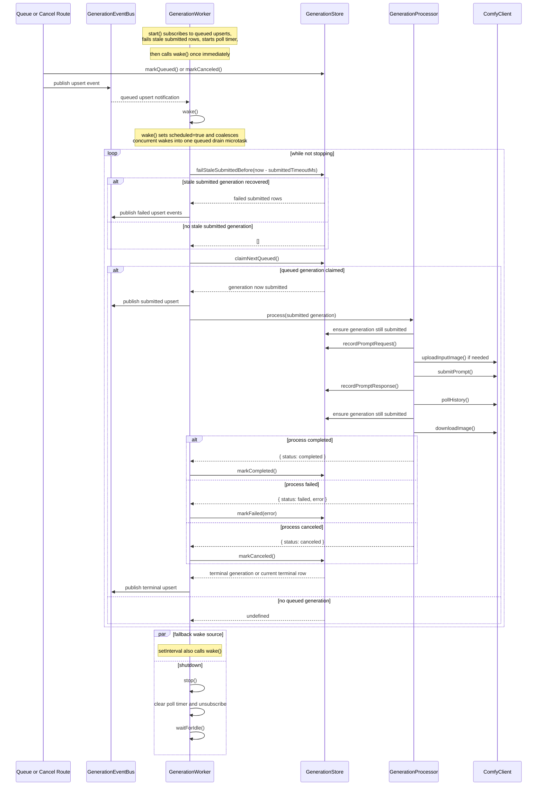
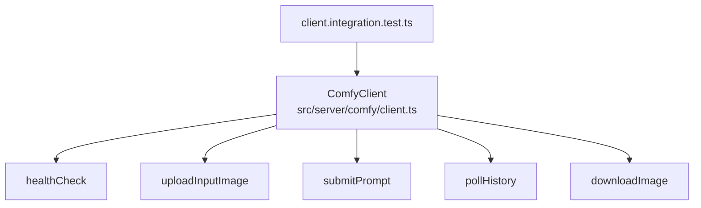

# Fuzzy Guacamole Architecture

Current code only. No planned or proposed architecture is documented here.

## Runtime Overview

## Server Surface

```mermaid
flowchart TD
  Start["src/server/index.ts"] --> Build["buildServer()"]
  Start --> Config["loadAppConfig()"]
  Start --> Catalog["loadPresetCatalog()"]
  Start --> Worker["createGenerationWorker()"]
  Build --> Health["GET /healthz"]
  Build --> Status["GET /api/status"]
  Build --> ComfyStart["POST /api/comfy/start"]
  Build --> PresetsList["GET /api/presets"]
  Build --> PresetsDetail["GET /api/presets/*"]
  Build --> GenerationsList["GET /api/generations"]
  Build --> GenerationDetail["GET /api/generations/:generationId"]
  Build --> GenerationCreate["POST /api/generations"]
  Build --> GenerationUpdate["PATCH /api/generations/:generationId"]
  Build --> GenerationUpload["POST /api/generations/:generationId/input"]
  Build --> GenerationQueue["POST /api/generations/:generationId/queue"]
  Build --> GenerationCancel["POST /api/generations/:generationId/cancel"]
  Build --> GenerationDelete["DELETE /api/generations/:generationId"]
  Build --> GenerationEvents["GET /api/events/generations (SSE)"]
  Build --> OpenApiJson["GET /openapi/json"]
  Build --> OpenApiUi["GET /openapi"]
  Status --> Payload["state: Offline|Starting|Online|StartupFailed<br/>since: transition timestamp"]
  ComfyStart --> StartupTransition["Offline -> Starting -> Online|StartupFailed"]
  PresetsList --> PresetPayload["preset summaries only"]
  PresetsDetail --> PresetDetailPayload["preset summary + template workflow + model metadata"]
  GenerationCreate --> GenerationPayload["status=draft<br/>templateId resolved from preset<br/>model-backed param validation<br/>resolved defaults persisted"]
  GenerationUpdate --> EditablePayload["draft/completed/failed/canceled editable snapshot<br/>preset switch updates templateId<br/>queued/submitted return 409"]
  GenerationQueue --> QueueTransition["validate resolved params + workflow tokens<br/>persist executionSnapshot + queuedAt<br/>draft/completed/failed/canceled -> queued"]
  QueueTransition --> WorkerClaim["shared event bus wakes worker<br/>oldest queued row claimed atomically"]
  WorkerClaim --> WorkerTerminal["queued -> submitted -> completed|failed|canceled"]
  QueueTransition --> PersistedExecution["executionSnapshot stored in DB"]
  WorkerTerminal --> PersistedPrompt["promptRequest + promptResponse stored in DB"]
  WorkerTerminal --> OutputPersist["downloaded output saved under<br/>/data/outputs/{generationId}/"]
  GenerationCancel --> CancelTransition["queued -> canceled<br/>submitted -> interrupt -> canceled|failed"]
  GenerationUpload --> InputPersist["multipart image persisted to<br/>/data/inputs/{generationId}/original/"]
  GenerationDelete --> DeletePersist["draft/queued/completed/failed/canceled rows deleted<br/>and input/output folders removed"]
  GenerationEvents --> LiveUpdates["live-only upsert/deleted events"]
```

Implemented routes:
- `GET /healthz` -> `{ ok: true }`
- `GET /api/status` -> live runtime status payload validated via shared Zod schema
- `POST /api/comfy/start` -> initiates or joins the explicit startup sequence and returns current startup state
- `GET /api/presets` -> preset metadata list loaded from disk at startup
- `GET /api/presets/{presetId}` -> wildcard-backed route (`/api/presets/*`) returning metadata + resolved template + resolved `model.json`
- `GET /api/generations` -> generation list ordered by `createdAt` descending
- `GET /api/generations/{generationId}` -> single generation detail
- `POST /api/generations` -> creates draft generation from preset + params after model-driven validation/default resolution and persists resolved defaults in `presetParams`
- `PATCH /api/generations/{generationId}` -> updates editable generation snapshots in draft/completed/failed/canceled states, resolves defaults, updates `templateId` from the target preset, preserves same-preset runtime-only params such as `inputImagePath`, and returns `409` for queued/submitted rows
- `POST /api/generations/{generationId}/input` -> accepts multipart file upload, stores path in `presetParams.inputImagePath`, and returns `204`
- `POST /api/generations/{generationId}/queue` -> validates resolved preset/runtime params plus workflow template tokens, persists the full internal `executionSnapshot`, then transitions generation to `queued` and sets `queuedAt`; the background worker then claims queued rows oldest-first and moves them to a terminal state
- `POST /api/generations/{generationId}/cancel` -> transitions `queued` generation to `canceled`, or interrupts submitted work through Comfy and resolves to `canceled` or `failed`
- `DELETE /api/generations/{generationId}` -> deletes draft/queued/completed/failed/canceled generations and removes persisted input/output folders; submitted rows still return `409`
- `GET /api/events/generations` -> SSE stream for live generation upsert/deleted notifications
- `GET /openapi/json` and `GET /openapi` -> OpenAPI spec + Swagger UI generated from Fastify route schemas

Current worker behavior:
- `src/server/index.ts` creates one shared generation event bus, one generation store, and one background worker for the process.
- The worker subscribes to queued `upsert` events, also polls on a fallback interval, and drains queued generations one at a time.
- Postgres claims use one atomic SQL statement ordered by `queuedAt`, then `createdAt`, then `id`.
- On startup, any generation left in `submitted` is marked `failed` with the error `Generation processing was interrupted during server shutdown.` and an `upsert` event is published for each recovered row.
- On every drain pass, before claiming queued work, the worker also marks any `submitted` generation whose `updatedAt` is older than `now() - submittedTimeoutMs` as `failed` with the error `Generation processing timed out while waiting in submitted state.`, then publishes `upsert` events for those recovered rows.
- Create and editable update routes persist resolved preset/model defaults in `presetParams`; queue time resolves the current snapshot with runtime values into one `executionSnapshot`, normalizes random seeds once, and stores that snapshot on the generation row.
- The processor consumes the persisted `executionSnapshot` as the authoritative worker input, uploads img2img input through Comfy when needed, persists prompt request/response metadata, polls history until an output is available, downloads one deterministic output image, and saves it under `/data/outputs/{generationId}/` with a timestamp-prefixed filename.
- Submitted cancellation is route-driven: the API interrupts Comfy, marks the generation `canceled` on success or `failed` on cancel failure, and the worker/processor stop if the row is no longer `submitted`.
- Internal prompt submission metadata stays server-local in the generation store; the public generation API and SSE payloads still expose only the minimal shared generation DTO.

## Worker Loop

These diagrams describe the control flow implemented in `src/server/generations/worker.ts` and the worker-to-store/processor interactions it coordinates.

```mermaid
flowchart TD
  Start["worker.start()"] --> Subscribe["subscribe to event bus<br/>wake on queued upsert"]
  Subscribe --> RecoverStartup["failSubmittedOnStartup()"]
  RecoverStartup --> StartupRecovered{"submitted rows recovered?"}
  StartupRecovered -->|yes| PublishStartupRecovered["publish failed upsert events"]
  StartupRecovered -->|no| Poll["start fallback poll interval"]
  PublishStartupRecovered --> Poll
  Poll --> InitialWake["wake()"]

  InitialWake --> WakeGuard{"started and not stopping?"}
  WakeGuard -->|no| WakeReturn["return"]
  WakeGuard -->|yes| FlagScheduled["set scheduled = true"]
  FlagScheduled --> AlreadyBusy{"running or queuedTask?"}
  AlreadyBusy -->|yes| Coalesce["coalesce wake request"]
  AlreadyBusy -->|no| QueueDrain["create idle promise<br/>queueMicrotask(drain)"]

  QueueDrain --> DrainEnter["drain()"]
  DrainEnter --> DrainGuard{"running or stopping?"}
  DrainGuard -->|yes| ResolveEarly["resolve idle if needed"]
  DrainGuard -->|no| BeginRun["set running = true"]

  BeginRun --> RecoverStale["failStaleSubmittedBefore(now - submittedTimeoutMs)"]
  RecoverStale --> StaleRecovered{"stale submitted rows recovered?"}
  StaleRecovered -->|yes| PublishStaleRecovered["publish failed upsert events"]
  StaleRecovered -->|no| Claim["claimNextQueued()"]
  PublishStaleRecovered --> Claim
  Claim --> Claimed{"queued row claimed?"}
  Claimed -->|no| FinishRun["set running = false"]
  Claimed -->|yes| PublishSubmitted["publish submitted upsert"]
  PublishSubmitted --> Process["processor.process(generation)"]
  Process --> Finalize["markCompleted / markFailed / markCanceled"]
  Finalize --> Terminal{"terminal row available?"}
  Terminal -->|yes| PublishTerminal["publish terminal upsert"]
  Terminal -->|no| ContinueLoop{"stopping?"}
  PublishTerminal --> ContinueLoop
  ContinueLoop -->|no| Claim
  ContinueLoop -->|yes| FinishRun

  FinishRun --> Reschedule{"scheduled and not stopping?"}
  Reschedule -->|yes| Rewake["wake() again"]
  Reschedule -->|no| ResolveIdle["resolve idle"]
```

## Comfy Module

The Comfy client has integration tests and endpoint-fallback handling. The runtime status service now uses it for readiness polling behind `GET /api/status` and `POST /api/comfy/start`.
The generation processor now uses this client directly for upload, submit, history polling, interrupt, and output download. The routes also use it for submitted cancellation via interrupt.
