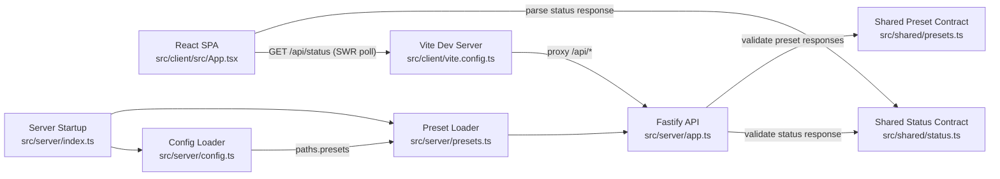
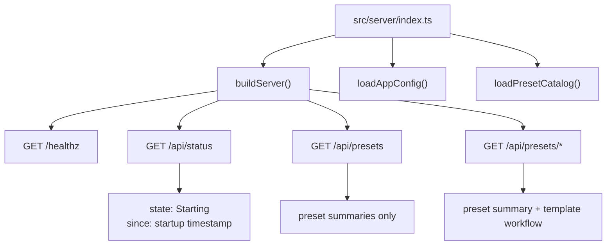
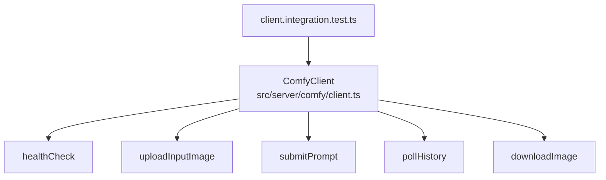

# Fuzzy Guacamole Architecture

Current code only. No planned or proposed architecture is documented here.

## Runtime Overview

## Server Surface

Implemented routes:
- `GET /healthz` -> `{ ok: true }`
- `GET /api/status` -> status payload validated via shared Zod schema
- `GET /api/presets` -> preset metadata list loaded from disk at startup
- `GET /api/presets/{presetId}` -> wildcard-backed route (`/api/presets/*`) returning metadata + resolved template

## Comfy Module (Implemented, Not Wired to API Routes)

The Comfy client has integration tests and endpoint-fallback handling, but current Fastify routes do not call it.
