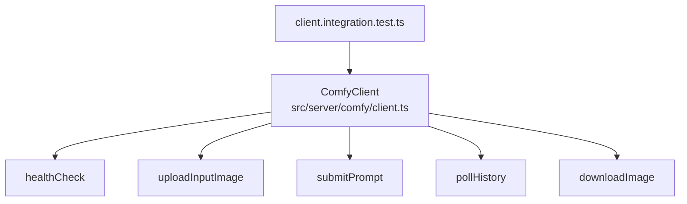

# Fuzzy Guacamole Architecture

Current code only. No planned or proposed architecture is documented here.

## Runtime Overview

```mermaid
flowchart LR
  Browser[React SPA<br/>src/client/src/App.tsx]
  Vite[Vite Dev Server<br/>src/client/vite.config.ts]
  API[Fastify API<br/>src/server/app.ts]
  Shared[Shared Zod Contract<br/>src/shared/status.ts]

  Browser -->|GET /api/status (SWR poll)| Vite
  Vite -->|proxy /api/*| API
  API -->|validate response| Shared
  Browser -->|parse response| Shared
```

## Server Surface

```mermaid
flowchart TD
  Start[src/server/index.ts] --> Build[buildServer()]
  Build --> Health[GET /healthz]
  Build --> Status[GET /api/status]
  Status --> Payload[state: Starting<br/>since: startup timestamp]
```

Implemented routes:
- `GET /healthz` -> `{ ok: true }`
- `GET /api/status` -> status payload validated via shared Zod schema

## Comfy Module (Implemented, Not Wired to API Routes)



The Comfy client has integration tests and endpoint-fallback handling, but current Fastify routes do not call it.
