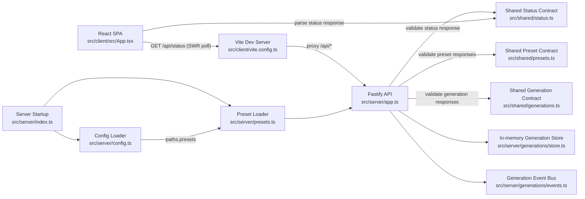
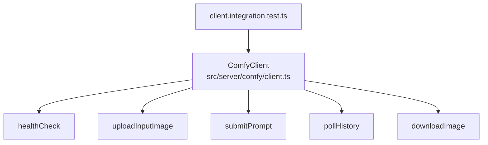

# Fuzzy Guacamole Architecture

Current code only. No planned or proposed architecture is documented here.

## Runtime Overview

## Server Surface

```mermaid
flowchart TD
  Start["src/server/index.ts"] --> Build["buildServer()"]
  Start --> Config["loadAppConfig()"]
  Start --> Catalog["loadPresetCatalog()"]
  Build --> Health["GET /healthz"]
  Build --> Status["GET /api/status"]
  Build --> PresetsList["GET /api/presets"]
  Build --> PresetsDetail["GET /api/presets/*"]
  Build --> GenerationsList["GET /api/generations"]
  Build --> GenerationDetail["GET /api/generations/:generationId"]
  Build --> GenerationCreate["POST /api/generations"]
  Build --> GenerationUpload["POST /api/generations/:generationId/input"]
  Build --> GenerationQueue["POST /api/generations/:generationId/queue"]
  Build --> GenerationCancel["POST /api/generations/:generationId/cancel"]
  Build --> GenerationDelete["DELETE /api/generations/:generationId"]
  Build --> GenerationEvents["GET /api/events/generations (SSE)"]
  Build --> OpenApiJson["GET /openapi/json"]
  Build --> OpenApiUi["GET /openapi"]
  Status --> Payload["state: Starting<br/>since: startup timestamp"]
  PresetsList --> PresetPayload["preset summaries only"]
  PresetsDetail --> PresetDetailPayload["preset summary + template workflow"]
  GenerationCreate --> GenerationPayload["status=draft<br/>templateId resolved from preset"]
  GenerationQueue --> QueueTransition["draft/completed/failed/canceled -> queued"]
  GenerationCancel --> CancelTransition["queued -> canceled<br/>other states -> 409"]
  GenerationUpload --> InputPersist["multipart image persisted to<br/>/data/inputs/{generationId}/original/"]
  GenerationEvents --> LiveUpdates["live-only upsert/deleted events"]
```

Implemented routes:
- `GET /healthz` -> `{ ok: true }`
- `GET /api/status` -> status payload validated via shared Zod schema
- `GET /api/presets` -> preset metadata list loaded from disk at startup
- `GET /api/presets/{presetId}` -> wildcard-backed route (`/api/presets/*`) returning metadata + resolved template
- `GET /api/generations` -> generation list ordered by `createdAt` descending
- `GET /api/generations/{generationId}` -> single generation detail
- `POST /api/generations` -> creates draft generation from preset + params
- `POST /api/generations/{generationId}/input` -> accepts multipart file upload, stores path in `presetParams.inputImagePath`, and returns `204`
- `POST /api/generations/{generationId}/queue` -> transitions generation to `queued` and sets `queuedAt`
- `POST /api/generations/{generationId}/cancel` -> transitions `queued` generation to `canceled` (other states currently return `409`)
- `DELETE /api/generations/{generationId}` -> deletes generation unless status is `submitted`
- `GET /api/events/generations` -> SSE stream for live generation upsert/deleted notifications
- `GET /openapi/json` and `GET /openapi` -> OpenAPI spec + Swagger UI generated from Fastify route schemas

## Comfy Module (Implemented, Not Wired to API Routes)

The Comfy client has integration tests and endpoint-fallback handling, but current Fastify routes do not call it.
